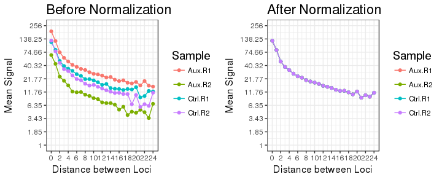
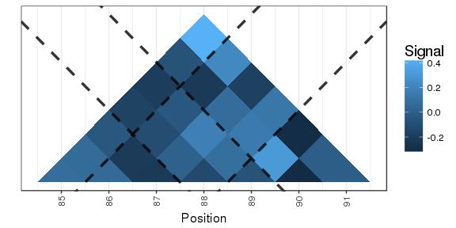
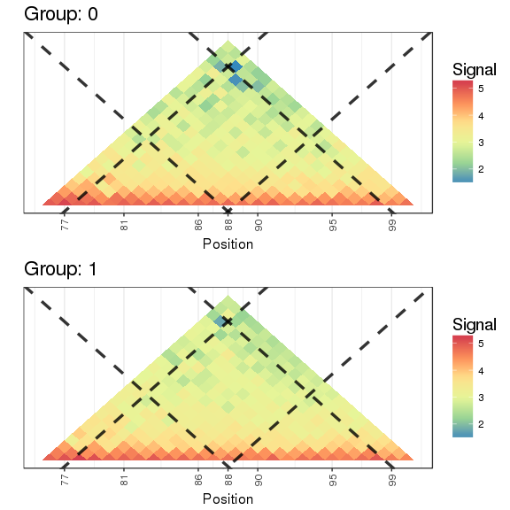

README
================
Zachary McCaw
Updated: 11/27/2017

Contents
========

-   [Formatting and Class Definitions](#formatting-and-class-definitions)
-   [Border Scores](#border-scores)
-   [Visualization](#visualization)

Formatting and Class Definitions
================================

Contents
--------

-   [Data Formatting](#data-formatting)
-   [DCS Objects](#dcs-objects)
-   [FS Objects](#fs-objects)

Data Formatting
---------------

#### Extraction from SparseHiC Objects

Input contact matrices for individual chromosomes are expected to have class `dtCMatrix`, defined in the `Matrix` package. If starting from a `sparseHiCdatum`, defined in the `sparseHiC` package, contact matrices of class `dtCMatrix` are available in the `resolutionNamedList`. The `sparseHiC` package is available on [github](https://github.com/aryeelab/sparseHiC.git). The follow example demonstrates extraction of a contact matrix from a `sparseHiCdatum`.

``` r
# Installation of sparseHiC package:
# devtools::install_github("aryeelab/sparseHiC");
library(DCS);
# Example of sparse HiC datum
cat("Class of sHicDatum:\n");
class(sHicDatum);
cat("\n");
cat("Available Resolutions:\n");
names(sHicDatum@resolutionNamedList);
cat("\n");
cat("Available Chromosomes at 40kb Resolution:\n");
names(sHicDatum@resolutionNamedList[["40000"]]);
cat("\n");
# Extracting Contact Matrix for Chromosome 1 at 40kb Resolution
M = sHicDatum@resolutionNamedList[["40000"]]$chr1;
cat("Class of Contact Matrix:\n");
class(M);
```

    ## Class of sHicDatum:
    ## [1] "sparseHiCdatum"
    ## attr(,"package")
    ## [1] "sparseHiC"
    ## 
    ## Available Resolutions:
    ## [1] "20000" "40000"
    ## 
    ## Available Chromosomes at 40kb Resolution:
    ## [1] "chr1"
    ## 
    ## Class of Contact Matrix:
    ## [1] "dtCMatrix"
    ## attr(,"package")
    ## [1] "Matrix"

#### Contact Matrix Aggregation

Contact matrices for individual chromosomes are formatted as objects of class `DCSchr`. Chromosomes from the same subject are aggregated into a sample, and samples are combined into an experiment of class `DCSexp`. In the following, a sample of HiC data available from the NCBI GEO, accession **GSE98671**, are considered. `A1` and `A2` contain data from MES cells depleted of CTCF using auxin. `C1` and `C2` contain data from control MES cells. Each is a list of two `dtCMatrix`-class sparse contact matrices for chromosomes `chr1` and `chr2`. The contact matrices for individual chromosomes are formatted into `DCSchr` objects and aggregated into a sample using `createDCSsmp`. The sample level data are combined into an experiment using `createDCSexp`.

``` r
# Auxin 
A1 = DCS::Auxin_rep1;
A2 = DCS::Auxin_rep2;
# Control
C1 = DCS::Control_rep1;
C2 = DCS::Control_rep2;
# Combine sparse matrices for individual chromosomes within a sample
Auxin1 = DCS::createDCSsmp(L=A1,chr=c("1","2"),smp="Aux.R1",group=0);
Auxin2 = DCS::createDCSsmp(L=A2,chr=c("1","2"),smp="Aux.R2",group=0);
Ctrl1 = DCS::createDCSsmp(L=C1,chr=c("1","2"),smp="Ctrl.R1",group=1);
Ctrl2 = DCS::createDCSsmp(L=C2,chr=c("1","2"),smp="Ctrl.R2",group=1);
# Combine samples into an experiment
Exp = DCS::createDCSexp(L=list(Auxin1,Auxin2,Ctrl1,Ctrl2));
head(Exp);
```

    ## Chromosome:       1
    ## Samples:      Aux.R1  Aux.R2  Ctrl.R1  Ctrl.R2 
    ## Groups:   0  0  1  1 
    ## Pixels:   325 
    ## 
    ## Data: 
    ##    i  j d    Aux.R1   Aux.R2   Ctrl.R1   Ctrl.R2
    ## 1 76 76 0 212.04500 77.02086 152.96079 105.11542
    ## 2 76 77 1 159.54523 73.57463  90.55706 105.65917
    ## 3 76 78 2 110.35403 38.92145  81.86155  59.86963
    ## 4 76 79 3  89.76870 22.50423  19.32057  26.18310
    ## 5 76 80 4  57.42157 15.05683  61.28800  37.02741
    ## 6 76 81 5  31.44170  7.23277  33.97521  34.99212
    ## 
    ## Chromosome:       2
    ## Samples:      Aux.R1  Aux.R2  Ctrl.R1  Ctrl.R2 
    ## Groups:   0  0  1  1 
    ## Pixels:   325 
    ## 
    ## Data: 
    ##    i  j d    Aux.R1   Aux.R2   Ctrl.R1   Ctrl.R2
    ## 3 76 76 0 247.61850 90.09601 167.68592 169.00690
    ## 4 76 77 1 149.73209 45.04939 108.43718  91.76675
    ## 5 76 78 2  98.79389 23.03154  68.04000  58.51669
    ## 6 76 79 3  77.32843 25.09985  52.25259  39.72100
    ## 7 76 80 4  71.62674 17.67890  43.26727  36.33301
    ## 8 76 81 5  46.02463 17.07255  38.31828  26.87674

Differential Contact Score Objects
----------------------------------

#### Structure

An object of class `DCSchr` has the following slots:

-   `@chr`, a string naming the chromosome.
-   `@Coord`, an *n*<sub>*p*</sub> by 3 matrix of pixel coordinates, where *n*<sub>*p*</sub> is the number of pixels on the chromosome. `@Coord` has columns (*i*, *j*, *d*), where *i* and *j* index pixel position, and *d* = (*j* − *i*) is the separation between the interacting loci. Coordinates are in upper-triangular format, i.e. *i* ≤ *j*.
-   `@Counts`, an *n*<sub>*p*</sub> by *n*<sub>*s*</sub> matrix, where *n*<sub>*s*</sub> is the number of samples.
-   `@groups`, a factor of group assignments for the samples.
-   `@samples`, a character vector of sample names.
-   `@Stats`, an *n*<sub>*p*</sub> by *n*<sub>*q*</sub> data.frame, where *n*<sub>*q*</sub> is the number of available test statistics.

``` r
# Extracting chromosome one
A.1 = Exp@Data[["1"]];
# Structure of a DCS chromosome
str(A.1);
```

    ## Formal class 'DCSchr' [package "DCS"] with 6 slots
    ##   ..@ chr    : chr "1"
    ##   ..@ Coord  : int [1:325, 1:3] 76 76 76 76 76 76 76 76 76 76 ...
    ##   .. ..- attr(*, "dimnames")=List of 2
    ##   .. .. ..$ : chr [1:325] "1" "2" "3" "4" ...
    ##   .. .. ..$ : chr [1:3] "i" "j" "d"
    ##   ..@ Counts : num [1:325, 1:4] 212 159.5 110.4 89.8 57.4 ...
    ##   .. ..- attr(*, "dimnames")=List of 2
    ##   .. .. ..$ : chr [1:325] "1" "2" "3" "4" ...
    ##   .. .. ..$ : chr [1:4] "Aux.R1" "Aux.R2" "Ctrl.R1" "Ctrl.R2"
    ##   ..@ groups : Factor w/ 2 levels "0","1": 1 1 2 2
    ##   ..@ samples: chr [1:4] "Aux.R1" "Aux.R2" "Ctrl.R1" "Ctrl.R2"
    ##   ..@ Stats  :'data.frame':  0 obs. of  0 variables

An object of class `DCSexp` has the following slots:

-   `@chrs`, a character vector of chromosome names.
-   `@Data`, is a list of `DCSchr`s, with names corresponding to `@chrs`.
-   `@groups`, a factor of group assignments for the samples.
-   `@samples`, a character vector of sample names.

Note that the `@groups` and `@samples` slots for the overall `DCSexp` should match the corresponding slots of the component `DCSchr`s.

``` r
# Structure of a DCS experiment
str(Exp);
```

    ## Formal class 'DCSexp' [package "DCS"] with 4 slots
    ##   ..@ chrs   : chr [1:2] "1" "2"
    ##   ..@ Data   :List of 2
    ##   .. ..$ 1:Formal class 'DCSchr' [package "DCS"] with 6 slots
    ##   .. .. .. ..@ chr    : chr "1"
    ##   .. .. .. ..@ Coord  : int [1:325, 1:3] 76 76 76 76 76 76 76 76 76 76 ...
    ##   .. .. .. .. ..- attr(*, "dimnames")=List of 2
    ##   .. .. .. .. .. ..$ : chr [1:325] "1" "2" "3" "4" ...
    ##   .. .. .. .. .. ..$ : chr [1:3] "i" "j" "d"
    ##   .. .. .. ..@ Counts : num [1:325, 1:4] 212 159.5 110.4 89.8 57.4 ...
    ##   .. .. .. .. ..- attr(*, "dimnames")=List of 2
    ##   .. .. .. .. .. ..$ : chr [1:325] "1" "2" "3" "4" ...
    ##   .. .. .. .. .. ..$ : chr [1:4] "Aux.R1" "Aux.R2" "Ctrl.R1" "Ctrl.R2"
    ##   .. .. .. ..@ groups : Factor w/ 2 levels "0","1": 1 1 2 2
    ##   .. .. .. ..@ samples: chr [1:4] "Aux.R1" "Aux.R2" "Ctrl.R1" "Ctrl.R2"
    ##   .. .. .. ..@ Stats  :'data.frame': 0 obs. of  0 variables
    ##   .. ..$ 2:Formal class 'DCSchr' [package "DCS"] with 6 slots
    ##   .. .. .. ..@ chr    : chr "2"
    ##   .. .. .. ..@ Coord  : int [1:325, 1:3] 76 76 76 76 76 76 76 76 76 76 ...
    ##   .. .. .. .. ..- attr(*, "dimnames")=List of 2
    ##   .. .. .. .. .. ..$ : chr [1:325] "3" "4" "5" "6" ...
    ##   .. .. .. .. .. ..$ : chr [1:3] "i" "j" "d"
    ##   .. .. .. ..@ Counts : num [1:325, 1:4] 247.6 149.7 98.8 77.3 71.6 ...
    ##   .. .. .. .. ..- attr(*, "dimnames")=List of 2
    ##   .. .. .. .. .. ..$ : chr [1:325] "3" "4" "5" "6" ...
    ##   .. .. .. .. .. ..$ : chr [1:4] "Aux.R1" "Aux.R2" "Ctrl.R1" "Ctrl.R2"
    ##   .. .. .. ..@ groups : Factor w/ 2 levels "0","1": 1 1 2 2
    ##   .. .. .. ..@ samples: chr [1:4] "Aux.R1" "Aux.R2" "Ctrl.R1" "Ctrl.R2"
    ##   .. .. .. ..@ Stats  :'data.frame': 0 obs. of  0 variables
    ##   ..@ groups : Factor w/ 2 levels "0","1": 1 1 2 2
    ##   ..@ samples: chr [1:4] "Aux.R1" "Aux.R2" "Ctrl.R1" "Ctrl.R2"

#### Methods

-   A `summary` method is available for objects of class `DCSexp`. Two matrices are printed and returned. The first describes the pixels and maximal pixel separation for each chromosome in the experiment. The second describes the samples and their group assignments.
-   A `subset` method is available for objects of class `DCSchr`. Subsetting by either pixel or maximal pixel separation is available. To subset by pixel, supply a logical vector with length equal to the number of pixels. To subset by pixel separation, provided a (numeric) maximal separation.
-   A `subset` method is available for objects of class `DCSexp`. Subsetting by chromosome and maximal pixel separation is available. To subset by chromosome, specify the chromosomes to retain. To subset by pixel separation, provided a (numeric) maximal separation.
-   An `as.data.frame` method is available for objects of class `DCSchr` and `DCSexp`.

``` r
# Summary of DCS Experiment
cat("DCS Experiment Summary:\n");
S = summary(Exp);
cat("\n");
# Subsetting a DCS Chromosome using a logical vector
S = subset(x=A.1,pix=(A.1@Coord[,"i"]==80));
# Subsetting a DCS Chromosome
S = subset(x=A.1,dmax=10);
# Subsetting a DCS Experiment
S = subset(x=Exp,chrs=c("1"),dmax=10);
# Coercion to data.frame
cat("Head of Experiment Matrix, Chromosome 1, Max Separation 10, following Coercion:\n");
S.df = as.data.frame(S);
head(S.df);
```

    ## DCS Experiment Summary:
    ##   Chr Pixels dMax
    ## 1   1    325   24
    ## 2   2    325   24
    ## 
    ##    Sample Group
    ## 1  Aux.R1     0
    ## 2  Aux.R2     0
    ## 3 Ctrl.R1     1
    ## 4 Ctrl.R2     1
    ## 
    ## Head of Experiment Matrix, Chromosome 1, Max Separation 10, following Coercion:
    ##   Chr  i  j d    Aux.R1   Aux.R2   Ctrl.R1   Ctrl.R2
    ## 1   1 76 76 0 212.04500 77.02086 152.96079 105.11542
    ## 2   1 76 77 1 159.54523 73.57463  90.55706 105.65917
    ## 3   1 76 78 2 110.35403 38.92145  81.86155  59.86963
    ## 4   1 76 79 3  89.76870 22.50423  19.32057  26.18310
    ## 5   1 76 80 4  57.42157 15.05683  61.28800  37.02741
    ## 6   1 76 81 5  31.44170  7.23277  33.97521  34.99212

Focal Stat Objects
------------------

#### Structure

An object of class `FSchr` has the following slots:

-   `@chr`, a string naming the chromosome.
-   `@foci`, a numeric vector of foci. A **focus** refers to a pixel for which *i* = *j*, i.e. a pixel on the diagonal of the contact matrix.
-   `@groups`, a factor naming the groups. Data in an `FSchr` are summarized at the group level.
-   `@Stats`, a list of data.frames with names corresponding to `@groups`. Each data frame is *n*<sub>*f*</sub> by *n*<sub>*q*</sub>, where *n*<sub>*f*</sub> is the number of foci, and *n*<sub>*q*</sub> is the number of available statistics.

``` r
# Extracting chromosome one
B.1 = DCS::B@Data[["1"]];
# Structure of a FS chromosome
str(B.1);
```

    ## Formal class 'FSchr' [package "DCS"] with 4 slots
    ##   ..@ chr   : chr "1"
    ##   ..@ foci  : num [1:25] 76 77 78 79 80 81 82 83 84 85 ...
    ##   ..@ groups: Factor w/ 2 levels "0","1": 1 2
    ##   ..@ Stats :List of 2
    ##   .. ..$ 0:'data.frame': 25 obs. of  3 variables:
    ##   .. .. ..$ Border : num [1:25] NA 2.98 3.31 3.32 3.27 ...
    ##   .. .. ..$ minPix : num [1:25] NA 1 3 6 10 15 21 28 36 45 ...
    ##   .. .. ..$ minProp: num [1:25] NA 1 1 1 1 1 1 1 1 1 ...
    ##   .. ..$ 1:'data.frame': 25 obs. of  3 variables:
    ##   .. .. ..$ Border : num [1:25] NA 2.93 3.04 3.32 2.97 ...
    ##   .. .. ..$ minPix : num [1:25] NA 1 3 6 10 15 21 28 36 45 ...
    ##   .. .. ..$ minProp: num [1:25] NA 1 1 1 1 1 1 1 1 1 ...

An object of class `FSexp` has the following slots:

-   `@chrs`, a character vector of chromosome names.
-   `@Data`, a list of `FSchr`s, with names corresponding to `@chrs`.
-   `@groups`, a factor naming the groups. Data in an `FSexp` are summarized at the group level.

Note that the `@groups` slots for the overall `FSexp` should match the corresponding slot of the component `FSchr`s.

``` r
# Structure of a FS experiment
str(DCS::B);
```

    ## Formal class 'FSexp' [package "DCS"] with 3 slots
    ##   ..@ chrs  : chr [1:2] "1" "2"
    ##   ..@ groups: Factor w/ 2 levels "0","1": 1 2
    ##   ..@ Data  :List of 2
    ##   .. ..$ 1:Formal class 'FSchr' [package "DCS"] with 4 slots
    ##   .. .. .. ..@ chr   : chr "1"
    ##   .. .. .. ..@ foci  : num [1:25] 76 77 78 79 80 81 82 83 84 85 ...
    ##   .. .. .. ..@ groups: Factor w/ 2 levels "0","1": 1 2
    ##   .. .. .. ..@ Stats :List of 2
    ##   .. .. .. .. ..$ 0:'data.frame':    25 obs. of  3 variables:
    ##   .. .. .. .. .. ..$ Border : num [1:25] NA 2.98 3.31 3.32 3.27 ...
    ##   .. .. .. .. .. ..$ minPix : num [1:25] NA 1 3 6 10 15 21 28 36 45 ...
    ##   .. .. .. .. .. ..$ minProp: num [1:25] NA 1 1 1 1 1 1 1 1 1 ...
    ##   .. .. .. .. ..$ 1:'data.frame':    25 obs. of  3 variables:
    ##   .. .. .. .. .. ..$ Border : num [1:25] NA 2.93 3.04 3.32 2.97 ...
    ##   .. .. .. .. .. ..$ minPix : num [1:25] NA 1 3 6 10 15 21 28 36 45 ...
    ##   .. .. .. .. .. ..$ minProp: num [1:25] NA 1 1 1 1 1 1 1 1 1 ...
    ##   .. ..$ 2:Formal class 'FSchr' [package "DCS"] with 4 slots
    ##   .. .. .. ..@ chr   : chr "2"
    ##   .. .. .. ..@ foci  : num [1:25] 76 77 78 79 80 81 82 83 84 85 ...
    ##   .. .. .. ..@ groups: Factor w/ 2 levels "0","1": 1 2
    ##   .. .. .. ..@ Stats :List of 2
    ##   .. .. .. .. ..$ 0:'data.frame':    25 obs. of  3 variables:
    ##   .. .. .. .. .. ..$ Border : num [1:25] NA 3.86 3.6 3.52 3.51 ...
    ##   .. .. .. .. .. ..$ minPix : num [1:25] NA 1 3 6 10 15 21 28 36 45 ...
    ##   .. .. .. .. .. ..$ minProp: num [1:25] NA 1 1 1 1 1 1 1 1 1 ...
    ##   .. .. .. .. ..$ 1:'data.frame':    25 obs. of  3 variables:
    ##   .. .. .. .. .. ..$ Border : num [1:25] NA 3.93 4.09 4.1 3.81 ...
    ##   .. .. .. .. .. ..$ minPix : num [1:25] NA 1 3 6 10 15 21 28 36 45 ...
    ##   .. .. .. .. .. ..$ minProp: num [1:25] NA 1 1 1 1 1 1 1 1 1 ...

#### Methods

-   A `subset` method is available for objects of class `FSchr`. Subsetting by focus and group is available. To subset by focus, supply a logical vector with length equal to the number of foci. To subset by group, specify the group(s) to retain.
-   A `subset` method is available for objects of class `FSexp`. Subsetting by chromosome and group is available. To subset chromosome, specify the chromosome(s) to retain. To subset by group, specify the group(s) to retain.
-   An `as.data.frame` method is available for objects of class `FSchr` and `FSexp`.

``` r
cat("Number of Foci:\n");
(nf = length(B.1@foci));
cat("\n");
# Subsetting a FSchr using a logical vector
S = subset(x=B.1,foci=c(rep(T,10),rep(F,nf-10)));
# Subsetting a FSchr by group
S = subset(x=B.1,group=c("0"));
# Subsetting a FSexp by chromsome and group
S = subset(x=B,chrs=c("1"),group=c("1"));
# Coercion to data.frame
cat("Head of Border Score Matrix, Chromosome 1, Group 1, following Coercion:\n");
S.df = as.data.frame(S);
head(S.df);
```

    ## Number of Foci:
    ## [1] 25
    ## 
    ## Head of Border Score Matrix, Chromosome 1, Group 1, following Coercion:
    ##   Chr Group Focus   Border minPix minProp
    ## 1   1     0    76       NA     NA      NA
    ## 2   1     0    77 2.984121      1       1
    ## 3   1     0    78 3.307178      3       1
    ## 4   1     0    79 3.320516      6       1
    ## 5   1     0    80 3.274793     10       1
    ## 6   1     0    81 3.072905     15       1

Border Scores
=============

Contents
--------

This vignette starts from an assembled `DCSexp`, and documents data normalization and boundary calling. For a guide to assembling the `DCSexp`, and descriptions of the object classes used in this package, see the vignette on **formatting and class definitions**.

-   [Pre-processing](#pre-processing)
-   [Normalization](#normalization)
-   [Boundary Calling](#boundary-calling)

Pre-processing
--------------

`preProcess` provides two functionalities. If `miss=T`, then all pixels within the maximal pixel separation for which measurements are missing are imputed to zeros. If `zero=T`, then all pixels corresponding to empty *foci* are subsequently removed. A *focus* refers to a pixel for which *i* = *j*, i.e. a pixel on the diagonal of the contact matrix.

``` r
# Preprocess
Exp = DCS::preProcess(X=Exp,miss=T,zero=T);
```

Normalization
-------------

`diagNormalize` rescales the input signals such that the mean intensity for a given pixel separation *d* is the same in all samples. This approach assumes that if all samples were sequenced to the same depth, then the expected interaction strength between loci at a given separation *d*, averaging across the genome, should not differ across samples. `scaleFactors` provides the sample by separation specific scale factors. `plotNormCurves` plots the signal by separation decay curves before and after normalization. `addLFC` is used to calculate the log<sub>2</sub> fold change, comparing each group to the first.

``` r
# Normalization
Z = DCS::diagNormalize(X=Exp);
# Scale factors
cat("Scale Factors:\n");
head(DCS::scaleFactors(Exp));
# Plot normalization curves
DCS::plotNormCurves(X=Exp,Z=Z);
```



``` r
# Add post-normalization log fold change to experiment
cat("\n");
cat("Post Normalization LFC:\n")
Z = DCS::addLFC(Z);
head(Z);
```

    ## Scale Factors:
    ##         Aux.R1   Aux.R2   Ctrl.R1   Ctrl.R2 d
    ## [1,] 0.6464146 1.947697 1.0724236 0.9929394 0
    ## [2,] 0.6591027 1.897836 0.9890220 1.0584587 1
    ## [3,] 0.6531312 2.018130 0.9723080 1.0582850 2
    ## [4,] 0.6538538 1.904742 0.9581132 1.1087918 3
    ## [5,] 0.6720964 2.041312 0.9357950 1.0486279 4
    ## [6,] 0.6662459 2.288030 0.8783328 1.0828663 5
    ## 
    ## Post Normalization LFC:
    ## Chromosome:       1
    ## Samples:      Aux.R1  Aux.R2  Ctrl.R1  Ctrl.R2 
    ## Groups:   0  0  1  1 
    ## Pixels:   325 
    ## 
    ## Data: 
    ##    i  j d    Aux.R1    Aux.R2  Ctrl.R1  Ctrl.R2      lfc_1v0
    ## 1 76 76 0 137.06897 150.01328 164.0388 104.3732 -0.096320822
    ## 2 77 77 0 154.79235 195.61383 173.4357 137.8083 -0.169952522
    ## 3 78 78 0 176.19591  96.53647 180.0646 188.8677  0.433128881
    ## 4 79 79 0 123.03405 175.63631 191.0508 129.0116  0.099157294
    ## 5 80 80 0  97.26689 117.93549 125.1313 131.5841  0.252325813
    ## 6 81 81 0 117.12628 152.79326 137.4692 131.2493 -0.006386561
    ## 
    ## Chromosome:       2
    ## Samples:      Aux.R1  Aux.R2  Ctrl.R1  Ctrl.R2 
    ## Groups:   0  0  1  1 
    ## Pixels:   325 
    ## 
    ## Data: 
    ##    i  j d   Aux.R1   Aux.R2   Ctrl.R1  Ctrl.R2     lfc_1v0
    ## 1 76 76 0 160.0642 175.4797 179.83035 167.8136  0.05081141
    ## 2 77 77 0 158.1471 117.0632 178.19897 171.7179  0.34425353
    ## 3 78 78 0 145.7656 136.0493 152.00594 158.2491  0.13777451
    ## 4 79 79 0 141.5033 144.7061  94.18988 146.6534 -0.24709196
    ## 5 80 80 0 138.0695 172.2926 160.51091 142.9427 -0.03226609
    ## 6 81 81 0 122.9586 127.9462 118.79869 137.9613  0.03302034

Boundary Calling
----------------

#### Border Scores

`BorderScores` calculates a border score by comparing the mean signal in potential intra-TAD regions upstream and downstream of a focus, with the mean signal in the inter-TAD region. Border scores are calculated separately for each group, and stored in the object of class `FSexp`. Two quality metrics are provided, the minimum number of pixels observed in any of the aggregation regions, and the minimum proportion of pixels observed in any of the aggregation regions. A value of `NA` for the quality metrics indicates that at least one of the aggregation regions was empty.

``` r
B = DCS::BorderScores(X=Z);
head(B);
```

    ## Chromosome:       1
    ## Groups:   0  1 
    ## Foci:     25 
    ## 
    ## Stats: 
    ##   Group Focus   Border minPix minProp
    ## 1     0    76       NA     NA      NA
    ## 2     0    77 2.984121      1       1
    ## 3     0    78 3.307178      3       1
    ## 4     1    76       NA     NA      NA
    ## 5     1    77 2.932702      1       1
    ## 6     1    78 3.040404      3       1
    ## 
    ## Chromosome:       2
    ## Groups:   0  1 
    ## Foci:     25 
    ## 
    ## Stats: 
    ##   Group Focus   Border minPix minProp
    ## 1     0    76       NA     NA      NA
    ## 2     0    77 3.858626      1       1
    ## 3     0    78 3.596234      3       1
    ## 4     1    76       NA     NA      NA
    ## 5     1    77 3.934265      1       1
    ## 6     1    78 4.089085      3       1

#### Segmentation

`callBoundaries` uses the border score to identify candidate, group-specific boundaries. A sliding window of length 2*h* is scanned across each chromosome. Within the window, the local mean *μ* and standard deviation *σ* are calculated. A z-score *Z*<sub>*j*</sub> is calculated for each focus *j* in the window using (*μ*, *σ*). Foci with *Z*<sub>*j*</sub> greater than or equal to the threshold *t* are taken as candidate boundaries. To ensure sufficient spacing between boundaries, if multiple candidates are within distance *w* of one another, that boundary with the highest border score is retained as the representative.

``` r
# Segment
C = DCS::callBoundaries(B=B,h=20,w=10,t=1);
cat("Candidate Boundaries:\n");
print(C);
```

    ## Candidate Boundaries:
    ##   Chr Group Focus   Border minPix minProp
    ## 1   1     0    79 3.320516      6       1
    ## 2   1     0    99 3.497027      1       1
    ## 3   2     0    77 3.858626      1       1
    ## 4   2     0    99 3.559822      1       1
    ## 5   1     1    79 3.315228      6       1
    ## 6   1     1    99 2.980698      1       1
    ## 7   2     1    79 4.098524      6       1

Visualization
=============

Contents
--------

This vignette describes functions available for visualizing a normalized `DCSexp`.

Visualization
-------------

#### Pixel-level Statistic

`plotHicStat` creates a heatmap plotting a statistic, such as the log fold change, at each pixel within a region. Data are supplied as either a `DCSexp`, together with the chromosome `chr` of interest, or directly as a `DCSchr`. The statistic `stat` to plot should correspond with a column in the `@Stats` slot of the focal `DCSchr`. `f` specifies the focus of the plot. `h.u` and `h.d` specify the length of the domain, upstream and downstream of the focus, whose interactions are included in the plot. For example, if *h*<sub>*u*</sub> = 2 and *h*<sub>*d*</sub> = 1, then the pixels included in the plot are:

𝒫 = {(*i*,*j*):*i*≤*j*,|*i*−*f*|≤*h*<sub>*u*</sub>=2,|*j*−*f*|≤*h*<sub>*l*</sub>=1}

``` r
# Import normalized HiC experiment
Z = DCS::Z;
# Plot log fold change 
Q = DCS::plotHicStat(In=Z,stat="lfc_1v0",f=88,chr="1",h.u=2,h.d=1,l.u=0,l.d=0);
print(Q$Plot);
```


The arguments `l.u` and `l.d` allow for the addition of flanks upstream and downstream of the domains specified by `h.u` and `h.d`:

``` r
# Plot with flanks
Q = DCS::plotHicStat(In=Z,stat="lfc_1v0",f=88,chr="1",h.u=2,h.d=1,l.u=1,l.d=2);
print(Q$Plot);
```



Loess smoothing of the statistic by pixel separation *d*<sub>*i**j*</sub> = |*i* − *j*| is available using `smooth=T`. Smoothing is conducted separately in each region delimited by the dashed guidelines. If a region contains fewer than 10 pixels, a simple average is taken. If the region contains between 10 and 20 pixels, loess using linear polynomials is applied. If the region contains 20 or more pixels, loess using quadratic polynomials is applied.

``` r
# Plot smoothed log fold change
Q = DCS::plotHicStat(In=Z,stat="lfc_1v0",f=88,chr="1",h.u=10,h.d=10,l.u=2,l.d=2,smooth=T);
print(Q$Plot);
```


#### Log HiC Signal

`plotHicSignal` creates a heatmap plotting the log HiC signal at each pixel within a region. The signal is extracted from the `@Counts` slot of the focal `DCSchr`. A separate plot is constructed for each group. For groups with multiple samples, the mean HiC signal is calculated before applying the logarithm. The plotting domain is specified as for `plotHicStat`, with optional smoothing. Color scales are standardized across groups.

``` r
# Plot raw HiC signal
Qr = DCS::plotHicSignal(In=Z,f=88,chr="1",h.u=10,h.d=10,l.u=10,l.d=10,smooth=F);
print(Qr$Plot);
```



``` r
# Plot smoothed HiC signal
Qs = DCS::plotHicSignal(In=Z,f=88,chr="1",h.u=10,h.d=10,l.u=10,l.d=10,smooth=T);
print(Qs$Plot);
```


